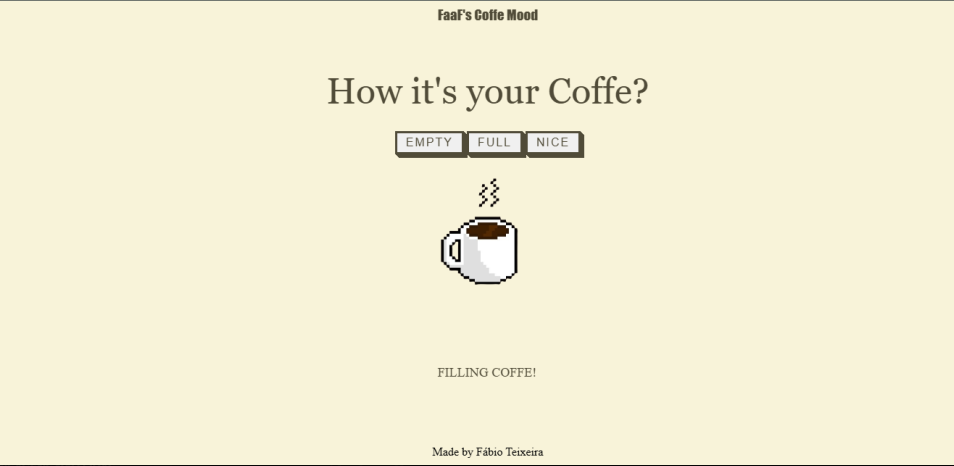

# FAAF'S COFFEE MOOD

> O FaaF's Coffee Mood é um site interativo onde você clica para indicar se sua caneca de café está cheia ou vazia. Ao escolher 'Empty', uma animação em pixel art mostra o café enchendo. Feito com HTML, CSS e JavaScript, é uma experiência simples e divertida!.

Link video demonstrativo do projeto: https://faaf-eng.github.io/FaaF-s-Coffee-Mood/

### Ajustes e melhorias

O projeto ainda está em desenvolvimento e as próximas atualizações serão voltadas para as seguintes tarefas:

- [x] Tarefa 1 - Sistema funcionando conforme proposta
- [x] Tarefa 2 - Otimização do código CSS para melhor desempenho das animações 
- [x] Tarefa 3 - JavaScript executando animações Pixel Art 
- [ ] Tarefa 4 - Adição de FrameWorks para melhorar responsividade
- [ ] Tarefa 5 - JavaScript vai evoluir para TypeScript, trazendo mais qualidade e organização ao código

## 💻 Pré-requisitos

Antes de começar, verifique se você atendeu aos seguintes requisitos:

- Um navegador moderno com JavaScript habilitado (necessário para as interações e animações)
- Recomendado abrir no computador para melhor visualização e interação com a animação em pixel art.

## 🤝 Colaboradores

Projeto independente criado por mim: 

https://www.linkedin.com/in/f%C3%A1bio-teixeira-479919238/

